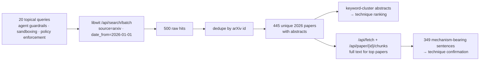
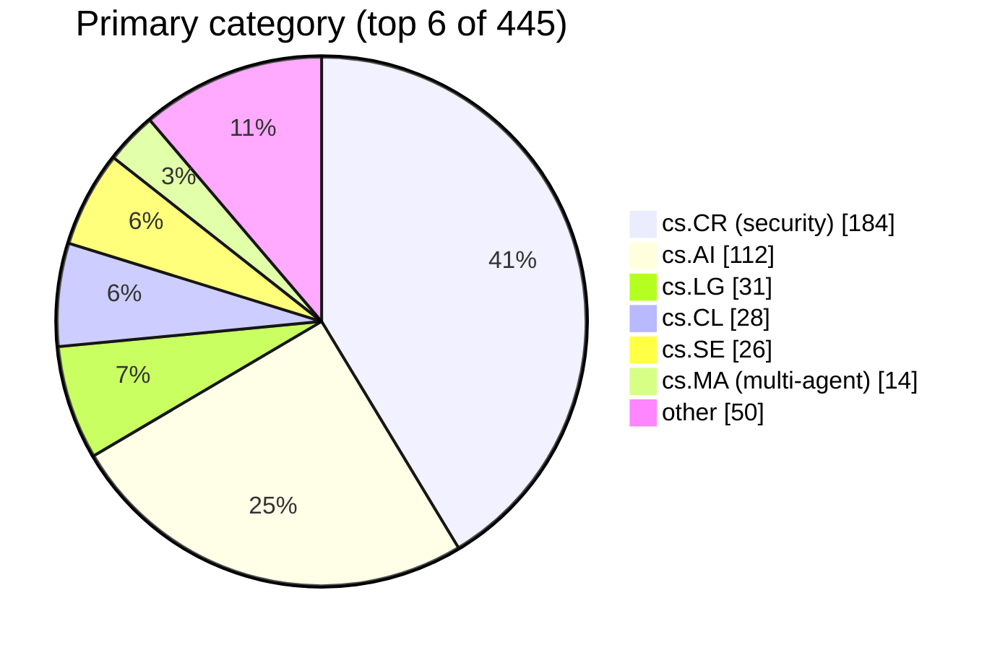
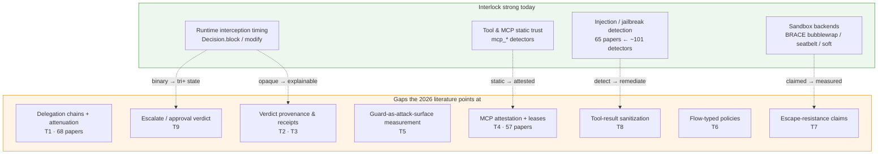

# Agent Guardrails in 2026 — a literature survey and roadmap input

**Question this answers:** across recent 2026 work on agent guardrails, safety,
sandboxing and policy enforcement, which *techniques* are the field converging on,
and which of them belong on interlock's roadmap?

**Corpus:** 445 unique 2026 arXiv papers, spread over all nine months of the year.
**Method:** 20 topical searches against a curated AI/ML full-text corpus, then
keyword-clustering of abstracts to rank techniques, then full-text verification
on the highest-value papers. Raw data in [`data/`](data/).

---

## 1. How the corpus was built

`/arxiv-search` was the intended tool, but its backend
(`arxiv.libwit.ai` / `.com`) is behind a Cloudflare zone that denies non-browser
clients. Two independent protections were isolated by controlled test:

| Layer | Trigger | Symptom |
|---|---|---|
| WAF rule on User-Agent | `Python-urllib`, empty UA, `Java/*` | `403 error code: 1010` (`browser_signature_banned`), `server: cloudflare` |
| Adaptive tarpit | request *volume*, any UA | connection held open, client read-timeout; clears after ~90 s |

The first layer is header-only — the same TLS client passes with a Chrome
`User-Agent`. The MCP server config sets `Authorization` but no `User-Agent`, so
the MCP client is denied by layer 1. Once a browser `User-Agent` was supplied and
requests were paced, the service worked, and it is the source of the corpus below
(the service stores + serves full text, which is what made step 3 possible).



## 2. Corpus at a glance

| Property | Value |
|---|---|
| Unique papers | **445** (all 2026) |
| Date range | 2026-01-03 → 2026-09-23 |
| Monthly spread | 29–63 papers/month (no single-month artefact) |
| Full text already cached | 257 / 445 |
| Full texts fetched + mined | 20 attempted, 4 completed before the tarpit returned |

Primary categories — the corpus is security-weighted, as expected:



Only 3 papers have ≥10 citations, which is what you'd expect for a year this
young — this corpus measures **what is being worked on**, not what has been
validated by time.

## 3. Technique frequency

Counted as: papers whose title+abstract matches the technique's vocabulary.
A paper can match several, so the column does not sum to 445.

| # | Technique cluster | Papers | % |
|---|---|---|---|
| 1 | Multi-agent / delegation trust | 68 | 15.3% |
| 2 | Injection & jailbreak detection | 65 | 14.6% |
| 3 | Tool / MCP surface hardening | 57 | 12.8% |
| 4 | Red teaming & evaluation harnesses | 37 | 8.3% |
| 5 | Sandbox / kernel isolation | 36 | 8.1% |
| 6 | Oversight scaling / debate / critics | 30 | 6.7% |
| 7 | Adversarial robustness **of the guard itself** | 25 | 5.6% |
| 8 | Governance & compliance translation | 24 | 5.4% |
| 9 | Provenance / attestation / receipts | 24 | 5.4% |
| 10 | Runtime interception / hooks | 20 | 4.5% |
| 11 | Formal & runtime verification | 18 | 4.0% |
| 12 | Human-in-the-loop / approval gating | 15 | 3.4% |
| 13 | Taint tracking / information-flow control | 11 | 2.5% |
| 14 | Trajectory anomaly detection | 10 | 2.2% |
| 15 | Secrets / credential protection | 10 | 2.2% |
| 16 | Egress / exfiltration control | 7 | 1.6% |
| 17 | Guard model / classifier | 5 | 1.1% |
| 18 | Capability / least-privilege permissioning | 4 | 0.9% |
| 19 | Declarative policy language / rule engine | 4 | 0.9% |

**Read this table with care.** It is an abstract-vocabulary proxy, and it is
biased toward *problem framing* over *solution mechanism* — hence "multi-agent
trust" leading while "policy engine" trails. Classic mechanism papers describe
their technique in the body, not the abstract. The full-text pass in §4 is what
corrects for this: there, capability/least-privilege and formal-guarantee
language dominate.

## 4. The techniques worth acting on

Ranked by (literature pull × fit with what interlock is). "Status" is measured
against the current tree, not the old roadmap.

### T1 — Delegation-chain trust and scope attenuation
**Top cluster (68 papers).** Agents delegate to sub-agents and to remote tool
servers faster than anyone has built the trust model for it. The recurring
requirement: a delegated agent must receive **strictly less** authority than its
delegator, and the chain must be auditable hop by hop.

- `2604.17517` *From Admission to Invariants: Measuring Deviation in Delegated Agent Systems*
- `2609.22949` *Beyond Single-Model Injection: A Threat Model and Defense Architecture*
- `2603.28166` *Evaluating Privilege Usage of Agents with Real-World Tools*

**Interlock status:** partial. `principal_scope()` splits a principal on `/` into a
hierarchical path, and scopes merge child-over-parent — but there is no explicit
*delegation* concept, no per-hop attenuation guarantee, and no bound on the depth
or breadth of a delegation.

### T2 — Pre-execution gating by causal attribution, not pattern match
The 2026 shift is from "does this call look bad?" to "**why** was this call
produced?" — attributing the call to the observation that caused it, then gating.

- `2609.14987` *ActGuard: Pre-execution Action Auditing against Indirect Prompt Injection*
- `2603.10749` *AttriGuard: Defeating Indirect Prompt Injection via Causal Attribution* — "counterfactual stability … the verifiable attribution signal that AttriGuard uses to **gate** upcoming tool calls"
- `2601.05755` *VIGIL: Verify-Before-Commit*
- `2609.11957` *Look Before You Leap: Pre-Action Verification for LLM Agents*

**Interlock status:** the *timing* is right — `Decision.block/modify` already
happens before the call runs. What's missing is the **explanation payload**: a
verdict carries no "which input caused this" field, so a caller can't act on
attribution and a reviewer can't audit the reason.

### T3 — Verifiable execution receipts ("proof of guardrail")
Not just a log line: a receipt that proves *the guardrail actually ran* and what it
decided, independently verifiable, with explicit trust boundaries stated.

- `2607.05397` *Proof of Execution: Runtime Verification for Governed AI Agent Actions*
- `2603.05786` *Proof-of-Guardrail in AI Agents and What (Not) to Trust from It*
- `2609.18411` *The Verifiable Action Card: Trustworthy Human-in-the-Loop Control*
- `2607.21325` *Toward cryptographically verifiable authorization for autonomous AI agents*

**Interlock status:** partial and *deliberately* so. Four provenance **stamp
detectors** ship (`event_hmac_stamp`, `content_digest_stamp`,
`sequence_number_stamp`, `provenance_origin_tag`), but there is no decision-level
receipt and no append-only sink — `decorator.py:45` still carries the "M4 replaces
this with signed receipts + an audit sink" note.

### T4 — Attested tool-server admission and capability leases for MCP
MCP's trust model is the single hottest concrete surface (57 papers in cluster 3).

- `2609.02690` *ACLE-MCP: Attested Capability Leases for Execution-Time Trust in Remote LLM Tool Use*
- `2605.24248` *Attested Tool-Server Admission: A Security Extension to the Model Context Protocol*
- `2604.16870` *Governed MCP: Kernel-Level Tool Governance via Logit-Based Safety Primitives*
- `2601.07395` *MCP-ITP: Automated Framework for Implicit Tool Poisoning in MCP*
- `2606.06387` *WebMCP Tool Surface Poisoning: Runtime Manipulation Attacks on LLM Agents*

**Interlock status:** partial. `mcp_server_allowlist`, `mcp_tool_pinning`,
`mcp_trust_registry` and `mcp_tool_description_scan` cover static trust. There is
no **attestation** (prove the server is the one you pinned) and no **lease** (a
grant that expires), and no detection of *runtime* tool-surface drift.

### T5 — The guardrail as an attack surface (over-defense and DoS)
A cluster that barely existed a year ago: guardrails fail closed too hard, or can
be made to refuse or stall.

- `2606.14517` *From Shield to Target: Denial-of-Service Attacks on LLM-Based Agent Guardrails*
- `2606.18356` *SafeClawBench: Separating Semantic, Audit-Evidence, and Sandbox Harm*
- `2604.24826` *A Comparative Evaluation of AI Agent Security Guardrails*
- `2601.18491` *AgentDoG: A Diagnostic Guardrail Framework* (over-defense)
- `2604.03870` *Your Agent is More Brittle Than You Think*

**Interlock status:** nothing. interlock is fail-closed by design, which is the
right default, but it has **no measurement of its own false-positive rate, no
cost model for a blocked action, and no resistance to being induced to block**.
For a library whose selling point is blocking, this is the most under-covered
area relative to its importance.

### T6 — Typed / flow-aware policy languages
The policy-language literature moved from flat rules to **typed** rules and
**source→sink flow** constraints.

- `2604.01483` *Type-Checked Compliance: Deterministic Guardrails for Agentic Financial Systems Using Lean 4*
- `2608.22868` *AgentFlow: A Flow-Centric Policy Language and Framework for Securing LLM Agent Systems*
- `2604.05229` *From Governance Norms to Enforceable Controls: A Layered Translation Method for Runtime Guardrails*
- `2604.15579` *Symbolic Guardrails for Domain-Specific Agents: Stronger Safety and Security Guarantees*

**Interlock status:** partial. Rules are Python predicates with a
`Template`/`Binding` parameter model — expressive but untyped, and there is no
dataflow dimension: nothing expresses "data that entered via tool X may not reach
argument Y."

### T7 — Sandboxing with unprivileged primitives + measured escape resistance
Directly adjacent to BRACE.

- `2605.26298` *Sandlock: Confining AI Agent Code with Unprivileged Linux Primitives*
- `2603.02277` *Quantifying Frontier LLM Capabilities for Container Sandbox Escape*
- `2605.29251` *Provably Secure Agent Guardrail* — neural-symbolic isolation over a verification state space of privilege / information-flow / execution attributes

**Interlock status:** good coverage, one gap and one inversion.
`bubblewrap` / `sandbox-exec` / `soft` are unprivileged; the strongest egress
backend, `nftables`, needs root + `CAP_NET_ADMIN`. The literature's direction is
the opposite — get strength *without* privilege — and it treats escape resistance
as something to *measure and publish*, which BRACE does not.

### T8 — Tool-result and observation sanitization
The injection channel that matters is the tool *result* and the tool
*description*, not the user prompt.

- `2601.04795` *Defense Against Indirect Prompt Injection via Tool Result Parsing*
- `2604.24118` *AgentVisor: Semantic Virtualization*
- `2602.22724` *AgentSentry: Temporal Causal Diagnostics*

**Interlock status:** partial. `indirect_injection_marker`,
`tool_output_override_guard` and `mcp_tool_description_scan` **detect**; the
tri-state `modify` verdict could **sanitize** a tool result, but nothing wires it
to the observation path.

### T9 — A fourth verdict: escalate
Fifteen papers converge on human approval as a distinct outcome — not allow, not
block, but *pause and ask, with evidence attached*.

- `2609.18411` *The Verifiable Action Card*
- `2609.19391` *MAGS: Multi-agent Auto-formalization Guarantees Safety*
- `2609.08015` *From Version Conflicts to Decision Conflicts: Selective Revalidation*

**Interlock status:** none. `Verdict` is `ALLOW / BLOCK / MODIFY`. There is no way
to express "this is legal but needs a human", so deployments approximate it by
blocking, which loses the action.

### T10 — Explicitly out of scope: logit / decoding-layer intervention
- `2604.05179` *Gradient-Controlled Decoding*
- `2604.16870` *Governed MCP* (logit-based safety primitives)

These operate inside the model. Interlock's whole premise is that it sits at the
process boundary and sees *real calls with real arguments* — reaching into logits
would change what the library is. Worth stating as a boundary rather than
half-building.

## 5. Proposed roadmap additions

Ordered by expected value. Each is scoped to be independently shippable.

| # | Roadmap item | Derived from | Why now | Acceptance criterion |
|---|---|---|---|---|
| R1 | **Delegation chains**: first-class `delegated_from`, with a guarantee that a child scope is a strict subset of its parent, and a configurable max depth | T1 (68 papers, top cluster) | Largest single cluster; interlock's `principal_scope` is already hierarchical, so this extends an existing abstraction rather than inventing one | A child binding that grants more than its parent is rejected at resolve time |
| R2 | **`Verdict.ESCALATE`** + `Decision.escalate(reason, evidence)` | T9, T3 | A 4th outcome is a small type change with outsized expressiveness; blocking is currently the only way to say "a human must decide" | `@guard` surfaces an escalation hook and the call does not proceed without a decision |
| R3 | **Verdict provenance**: optional `reason` + `attributed_to` on every `Decision`, plumbed to the event | T2, T3 | The timing already exists; only the payload is missing. Makes every block explainable and auditable | Every non-ALLOW decision can report the input that triggered it |
| R4 | **Signed execution receipts + append-only sink** (the open M4 item, re-specified) | T3 | The literature is explicit that a receipt must prove the guardrail *ran*, not merely that a log exists | A receipt verifies offline against a published key; tampering is detected |
| R5 | **Guardrail robustness harness**: false-positive rate on benign traffic, plus DoS resistance under load | T5 (nothing ships today) | For a fail-closed library, an unmeasured false-positive rate is a product risk, not just an eval gap | Published FP rate + a regression gate on a benign corpus |
| R6 | **MCP capability leases + server attestation** | T4 (57 papers) | Extends the existing `mcp_*` detectors from static allowlisting to time-boxed, attested grants | A lease expires and the tool call is denied; a swapped server fails admission |
| R7 | **Tool-result sanitization** via the existing `modify` verdict on the observation path | T8 | Reuses `Decision.modify`, which already exists; converts detection into remediation | A poisoned tool result is rewritten, not just flagged |
| R8 | **BRACE escape-resistance suite** + an unprivileged strongest-egress path | T7 | BRACE claims guarantees via `enforced` tokens; those claims should be tested and the root-requiring `nftables` gap closed | A test asserts each backend's escape resistance; egress confinement works without root |
| R9 | **Flow-typed policy dimension** (source→sink constraints) | T6 | The direction declarative policies should take when the YAML/JSON work happens — worth designing for now to avoid a rules-only dead end | A rule can express "output of tool A must not reach argument B" |
| R10 | **State the boundary**: document logit/decoding-layer work as explicitly out of scope | T10 | Prevents an incoherent half-implementation of the decoder layer | A file-scoped decision recorded in the roadmap |

## 6. Coverage map



## 7. Caveats

1. **Frequency is a proxy.** §3 counts abstract vocabulary, which over-weights
   problem framing and under-weights mechanism. §4 corrects with full text, but
   only 4 papers were mined in full before the rate limit returned — enough to
   confirm cluster rankings, not enough for a per-paper census.
2. **Retrieval was query-shaped.** The 20 seed queries define the corpus. A
   different query set would shift the tail; the head (T1–T5) is robust because
   those clusters surfaced from several independent queries.
3. **No citation filter.** 3 papers have ≥10 citations. This is a survey of 2026
   activity, not of settled results.
4. **The libwit backend is rate-limited by design.** Full-text mining at scale
   needs pacing of ~1 request / 10 s with a browser `User-Agent`; bursts are
   tarpitted for ~90 s. Adding a `User-Agent` header to the MCP server config
   fixes the deterministic 403.
5. **Reproduce:**
   ```bash
   # corpus (445 papers)
   jq -r '.results[].results[] | .arxiv_id' data/libwit-batch-search.json | sort -u | wc -l
   # keyword ranking
   python3 - <<'EOF'
   import json; d=json.load(open("data/technique-keyword-hits.json"))
   print(sorted(d["hits"].items(), key=lambda kv:-kv[1]))
   EOF
   ```
